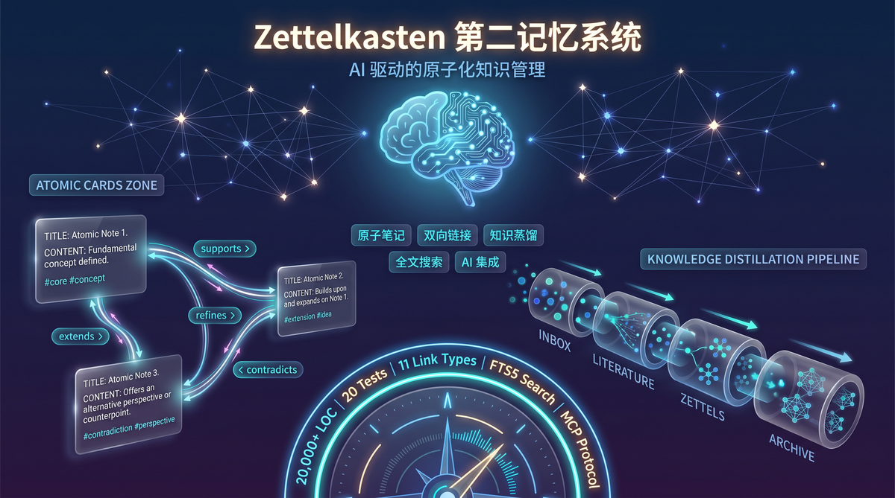

<p align="center">
  
</p>

# 🧠 Zettelkasten Second Memory

> A Zettelkasten note-taking system designed for the AI era — atomic notes, bi-directional linking, knowledge distillation, and intelligent retrieval.

[English](README.md) · [简体中文](README.zh.md)

[](LICENSE)
[](package.json)

---

## ✨ Core Features

| Feature | Description |
|---------|-------------|
| 📝 **Atomic Notes** | Each note is an independent knowledge unit, supporting `atomic` / `structure` / `source` types |
| 🔗 **Bi-directional Links** | 11 semantic link types (supports, refines, extends, contradicts, example-of...) to build a true knowledge graph |
| 🔍 **Full-text Search** | SQLite FTS5 + LIKE dual engine, supporting Chinese tokenization and fuzzy matching |
| 🤖 **AI Integration** | Deep MCP integration with OpenClaw, enabling AI agents to automatically capture conversation knowledge |
| 🔄 **Knowledge Distillation** | CEQRC pipeline automatically refines fragmented notes into permanent knowledge |
| 🏷️ **Tag System** | Flexible tag classification and statistics, supporting tag-cloud analysis |
| 📦 **Markdown Native** | All notes stored as Markdown, your data belongs entirely to you |
| 🧟 **Zombie Detection** | Auto-detect stale notes (180+ days, zero backlinks) with `zk_find_zombies` |
| ✨ **Glow Ranking** | Knowledge importance scoring via PageRank + citation + recency decay |
| 📦 **Archive System** | Move cold notes to `archive` folder; auto-archive nightly at 2:00 AM |
| 📜 **Audit Log** | Full archive/unarchive history with `zk_get_archive_log` |
| 🔎 **Path Discovery** | Weighted shortest path between any two notes with Chinese explanations |

---

> 🇨🇳 **Looking for Chinese documentation?** [点击这里查看简体中文介绍](README.zh.md)

---

## 📐 System Architecture

```
┌─────────────────────────────────────────────────────────┐
│                    OpenClaw Gateway                      │
│                  (MCP Protocol Layer)                    │
└──────────────────────┬──────────────────────────────────┘
                       │
┌──────────────────────▼──────────────────────────────────┐
│              Zettelkasten Plugin                         │
│  ┌─────────┐  ┌──────────┐  ┌─────────────┐            │
│  │  MCP    │  │   CLI    │  │  Session    │            │
│  │ Tools   │  │ Commands │  │   Hook      │            │
│  └────┬────┘  └────┬─────┘  └──────┬──────┘            │
│       └─────────────┴───────────────┘                   │
│                         │                                │
│  ┌──────────┬───────────┼───────────┬──────────┐        │
│  │ Service  │ Repository│  Storage  │  Core    │        │
│  │ Layer    │  Layer    │  Layer    │  Types   │        │
│  │          │           │           │          │        │
│  │• Note    │• NoteRepo │• DB Schema│• Types   │        │
│  │• Link    │• LinkRepo │• FTS5     │• Constants│       │
│  │• CEQRC   │• TagRepo  │• Templates│• Utils   │        │
│  │• Distill │• ReviewRepo│          │          │        │
│  └──────────┴───────────┴───────────┴──────────┘        │
│                         │                                │
│                    SQLite + Markdown                     │
└─────────────────────────────────────────────────────────┘
```

---

> 🇨🇳 **Chinese users**: [点击这里查看中文介绍](README.zh.md)

---

## 🚀 Quick Start

### Requirements

- **Node.js** >= 22.14.0 (requires built-in `node:sqlite`)
- **OpenClaw** >= 2026.4.23 (for AI integration)

### Installation

```bash
# Clone the repository
git clone https://github.com/YOUR_USERNAME/zettelkasten-second-memory.git
cd zettelkasten-second-memory

# Install dependencies
npm install

# Run tests
npm test
```

### Use as an OpenClaw Plugin

```bash
# 1. Deploy the plugin
bash scripts/deploy.sh

# 2. Configure OpenClaw (edit ~/.openclaw/openclaw.json)
# Ensure plugins.load.paths includes the plugin path

# 3. Restart the Gateway
openclaw gateway restart

# 4. Initialize the database
openclaw zk init

# 5. Health check
openclaw zk doctor
```

### Use as a Standalone Library

```typescript
import { createZettelkasten } from "zettelkasten-second-memory";

// Create a client
const zk = await createZettelkasten("./data/zettelkasten.db", "./data");

// Create a note
const note = await zk.createNote({
  title: "Hello Zettelkasten",
  content: "This is my first atomic note.",
  tags: ["intro", "demo"],
  type: "atomic",
});

// Search
const results = zk.searchNotes("atomic note", 10);
console.log(results);
```

---

## 🛠️ CLI Commands

| Command | Description |
|---------|-------------|
| `openclaw zk init` | Initialize database and directory structure |
| `openclaw zk doctor` | Run health checks |
| `openclaw zk status` | Show system status |
| `openclaw zk new` | Create a new note |
| `openclaw zk list` | List notes |
| `openclaw zk search <query>` | Search notes |
| `openclaw zk show <id>` | View note details |
| `openclaw zk link <from> <to>` | Create a note link |

---

## 🧩 MCP Tools (for AI Agents)

| Tool | Permission | Description |
|------|------------|-------------|
| `zk_search_notes` | Read | Full-text search for notes |
| `zk_get_note` | Read | Get a single note |
| `zk_get_backlinks` | Read | Get reverse links |
| `zk_find_path` | Read | Find paths between notes |
| `zk_create_note` | Write | Create a new note |
| `zk_update_note` | Write | Update a note |
| `zk_create_link` | Write | Create a note link |
| `zk_run_ceqrc` | Write | Run the cognitive pipeline |
| `zk_distill_memory` | Write | Distill session memories |
| `zk_review_note` | Write | Review a note |

---

## 📁 Project Structure

```
zettelkasten-second-memory/
├── src/
│   ├── core/               # Type definitions, constants, utilities
│   ├── storage/            # Database schema, FTS5, template manager
│   ├── repository/         # Data access layer (notes, links, tags, reviews...)
│   ├── service/            # Business logic (CEQRC, distillation, deduplication...)
│   ├── integration/        # OpenClaw integration (agent config, scheduler, hooks)
│   ├── mcp/                # MCP tool definitions and server
│   ├── plugin/             # OpenClaw plugin entry and manifest
│   ├── skills/brain/       # AI Skill (prompts, rules, evolution scripts)
│   ├── examples/           # Usage examples
│   └── index.ts            # Library entry point
├── scripts/                # Deployment scripts
├── plans/                  # Design documents and architecture diagrams
├── docs/                   # Documentation
├── package.json
├── LICENSE
└── README.md
```

---

## 🧠 Second Memory Skill (AI Integration)

This project includes a **Brain Skill** that enables AI agents to automatically save conversation knowledge into Zettelkasten:

```bash
# Install the Skill
cp -r src/skills/brain ~/.openclaw/skills/zettelkasten-brain

# Activate the Skill
openclaw config set agents.defaults.skills '["zettelkasten-brain"]'

# Restart the Gateway
openclaw gateway restart
```

Once activated, the AI will automatically:
- 🔍 Search the knowledge base before answering
- 📝 Recognize and save important information
- 🔗 Intelligently establish note associations
- 📦 Archive discussions when sessions end

---

## 📊 Database Schema

The system uses SQLite. Core tables include:

| Table | Description |
|-------|-------------|
| `zettel_notes` | Main notes table (title, content, status, confidence...) |
| `zettel_links` | Bi-directional links table (11 semantic link types) |
| `zettel_tags` | Tags table |
| `zettel_note_tags` | Note-tag association table |
| `zettel_reviews` | Review records table |
| `zettel_feedback` | Feedback data table |
| `zettel_prompt_versions` | Prompt version table |
| `zettel_meta` | Metadata table |

FTS5 virtual tables provide full-text search capabilities.

---

## 🧪 Testing

```bash
# Run all tests
npm test

# Watch mode
npm run test:watch
```

Current test coverage:
- Repository layer (CRUD, search, links, tags)
- Service layer (CEQRC, distillation, deduplication, parsing)
- Integration layer (configuration, scheduling)
- MCP Server (tool registration and invocation)

---

## 📜 License

[MIT](LICENSE) © Zettelkasten Contributors

---

## 🙏 Acknowledgements

- Inspired by [Niklas Luhmann](https://en.wikipedia.org/wiki/Niklas_Luhmann)'s Zettelkasten method
- Built on the [OpenClaw](https://github.com/openclaw) plugin architecture
- Uses SQLite FTS5 for full-text search
