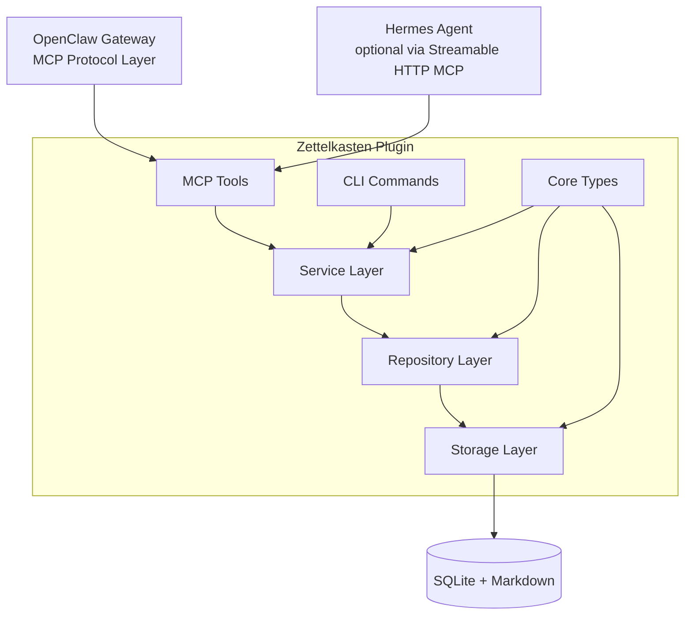

<p align="center">
  
</p>

# 🧠 Zettelkasten Second Memory

> **An [OpenClaw](https://github.com/openclaw) (2026.4/2026.6+) and [Hermes Agent](https://github.com/nousresearch/hermes-agent) plugin** that turns AI conversations into a permanent Zettelkasten knowledge base — atomic notes, bi-directional links, knowledge distillation, and intelligent retrieval via MCP tools.

[English](README.md) · [简体中文](README.zh.md)

[](https://github.com/cx2002302-lang/zettelkasten-second-memory/releases)
[](https://github.com/openclaw)
[](https://github.com/nousresearch/hermes-agent)
[](src/mcp/server.ts)
[](LICENSE)
[](package.json)

---

## 📌 Current Version

| Component | Version | Status |
|-----------|---------|--------|
| Plugin | `v1.0.0-beta.8` | Active development |
| Skill | `v1.0.0-beta.8` | Active development |
| OpenClaw | `2026.4.24/2026.6.x` | Developed & tested; compatible with >= 2026.4.23 |
| Hermes Agent | `v0.17.0` | Experimental support via MCP HTTP bridge |
| Node.js | `>= 22.14.0` | Required (for `node:sqlite`) |

**Latest Release**: [v1.0.0-beta.8](https://github.com/cx2002302-lang/zettelkasten-second-memory/releases/tag/v1.0.0-beta.8) — Compatibility adaptation for OpenClaw 2026.6.x and Hermes MCP bridge

---

## ✨ Core Features

| Feature | Description |
|---------|-------------|
| 📝 **Atomic Notes** | Each note is an independent knowledge unit, supporting `atomic` / `structure` / `source` types |
| 🔗 **Bi-directional Links** | 11 semantic link types (supports, refines, extends, contradicts, example-of...) to build a true knowledge graph |
| 🔍 **Full-text Search** | SQLite FTS5 + LIKE dual engine, supporting Chinese tokenization and fuzzy matching |
| 🤖 **AI Integration** | Deep MCP integration with OpenClaw and Hermes Agent, enabling AI agents to automatically capture conversation knowledge |
| 🔄 **Knowledge Distillation** | CEQRC pipeline automatically refines fragmented notes into permanent knowledge |
| 🏷️ **Tag System** | Flexible tag classification and statistics, supporting tag-cloud analysis |
| 📦 **Markdown Native** | All notes stored as Markdown, your data belongs entirely to you |
| 🧟 **Zombie Detection** | Auto-detect stale notes (180+ days, zero backlinks) with `zk_find_zombies` |
| ✨ **Glow Ranking** | Knowledge importance scoring via PageRank + citation + recency decay |
| 📦 **Archive System** | Move cold notes to `archive` folder; auto-archive nightly at 2:00 AM |
| 📜 **Audit Log** | Full archive/unarchive history with `zk_get_archive_log` |
| 🔎 **Path Discovery** | Weighted shortest path between any two notes with Chinese explanations |
| 🌉 **Hermes Bridge** | Optional Streamable HTTP MCP bridge exposes all tools to Hermes Agent (v0.17.0+) |

---

## ⚡ Performance Benchmark

**Tested on**: Node.js v22.22.2, SQLite `:memory:`  
**Scale**: 1,000 notes creation and search | **All tests passed** ✅  
**Current suite**: 1,724 unit / integration tests with Vitest

---

> 🇨🇳 **Looking for Chinese documentation?** [点击这里查看简体中文介绍](README.zh.md)

---

## 📐 System Architecture



---

> 🇨🇳 **Looking for Chinese documentation?** [点击这里查看简体中文介绍](README.zh.md)

---

## 🚀 Quick Start

### Requirements

- **Node.js** >= 22.14.0 (requires built-in `node:sqlite`)
- **OpenClaw** `2026.4.24/2026.6.x` (compatible with >= 2026.4.23)
- **Hermes Agent** `v0.17.0+` (optional, for Hermes integration)

### Installation

```bash
# Clone the repository
git clone https://github.com/cx2002302-lang/zettelkasten-second-memory.git
cd zettelkasten-second-memory

# Install dependencies
npm install

# Run tests
npm test
```

### Use as an OpenClaw Plugin

```bash
# 1. Deploy the plugin
bash scripts/deploy.sh

# 2. Configure OpenClaw (edit ~/.openclaw/openclaw.json)
# Ensure plugins.load.paths includes the plugin path

# 3. Restart the Gateway
openclaw gateway restart

# 4. Initialize the database
openclaw zk init

# 5. Health check
openclaw zk doctor
```

### Use with Hermes Agent (Optional)

```bash
# 1. Build the MCP bridge
npm run build:bridge

# 2. Start the bridge (adjust DB/notes paths to your OpenClaw setup)
ZETTELKASTEN_DB_PATH=~/.openclaw/zettelkasten/zettelkasten.db \
ZETTELKASTEN_NOTES_DIR=~/.openclaw/zettelkasten/notes \
ZETTELKASTEN_MCP_PORT=9090 \
node dist/mcp/http-bridge.js

# 3. In your Hermes config, add the MCP server:
# mcp_servers:
#   zettelkasten:
#     type: http
#     url: "http://<openclaw-host>:9090/mcp"
#     enabled: true

# 4. Verify connectivity
hermes mcp test zettelkasten
```

See [`docs/COMPATIBILITY.md`](docs/COMPATIBILITY.md) for version-specific notes.

## 🛠️ CLI Commands

| Command | Description |
|---------|-------------|
| `openclaw zk init` | Initialize database and directory structure |
| `openclaw zk doctor` | Run health checks |
| `openclaw zk status` | Show system status |
| `openclaw zk new` | Create a new note |
| `openclaw zk list` | List notes |
| `openclaw zk search <query>` | Search notes |
| `openclaw zk show <id>` | View note details |
| `openclaw zk link <from> <to>` | Create a note link |
| `openclaw zk review-stats` | View review statistics |
| `openclaw zk review-pending` | List pending reviews |
| `openclaw zk feedback-stats` | View feedback statistics |
| `openclaw zk prompt-stats` | View prompt evolution statistics |
| `openclaw zk curation-stats` | View sample curation statistics |

---

## 🧩 MCP Tools (for AI Agents)

| Tool | Permission | Description |
|------|------------|-------------|
| `zk_search_notes` | Read | Full-text search for notes |
| `zk_get_note` | Read | Get a single note |
| `zk_get_backlinks` | Read | Get reverse links |
| `zk_find_path` | Read | Find paths between notes |
| `zk_create_note` | Write | Create a new note |
| `zk_update_note` | Write | Update a note |
| `zk_create_link` | Write | Create a note link |
| `zk_run_ceqrc` | Write | Run the cognitive pipeline |
| `zk_distill_memory` | Write | Distill session memories |
| `zk_review_note` | Write | Review a note |
| `zk_get_review_panel` | Read | Get pending review panel |
| `zk_submit_review` | Write | Submit a review |
| `zk_get_review_stats` | Read | Get review statistics |
| `zk_submit_feedback` | Write | Submit user feedback |
| `zk_get_feedback_stats` | Read | Get feedback statistics |
| `zk_analyze_feedback_trends` | Read | Analyze feedback trends |
| `zk_get_active_prompt` | Read | Get active prompt version |
| `zk_get_prompt_stats` | Read | Get prompt evolution stats |
| `zk_get_curation_stats` | Read | Get curation statistics |
| `zk_export_samples` | Write | Export curated samples |

---

## 📁 Project Structure

```
zettelkasten-second-memory/
├── src/                    # Plugin source code
│   ├── core/               # Type definitions, constants, utilities
│   ├── storage/            # Database schema, FTS5, template manager
│   ├── repository/         # Data access layer (notes, links, tags, reviews...)
│   ├── service/            # Business logic (CEQRC, distillation, deduplication...)
│   ├── integration/        # OpenClaw integration (agent config, scheduler, hooks)
│   ├── mcp/                # MCP tool definitions and server
│   ├── plugin/             # OpenClaw plugin entry and manifest
│   ├── examples/           # Usage examples
│   └── index.ts            # Library entry point
├── skills/brain/           # AI Skill (prompts, rules, workflows)
├── scripts/                # Deployment scripts
├── docs/                   # Documentation
├── package.json
├── LICENSE
└── README.md
```

---

## 🧠 Second Memory Skill (AI Integration)

This project includes a **Brain Skill** that enables AI agents to automatically save conversation knowledge into Zettelkasten:

```bash
# Install the Skill
cp -r skills/brain ~/.openclaw/skills/zettelkasten-brain

# Activate the Skill
openclaw config set agents.defaults.skills '["zettelkasten-brain"]'

# Restart the Gateway
openclaw gateway restart
```

Once activated, the AI will automatically:
- 🔍 Search the knowledge base before answering
- 📝 Recognize and save important information
- 🔗 Intelligently establish note associations
- 📦 Archive discussions when sessions end

---

## 📊 Database Schema

The system uses SQLite. Core tables include:

| Table | Description |
|-------|-------------|
| `zettel_notes` | Main notes table (title, content, status, confidence...) |
| `zettel_links` | Bi-directional links table (11 semantic link types) |
| `zettel_tags` | Tags table |
| `zettel_note_tags` | Note-tag association table |
| `zettel_reviews` | Review records table |
| `zettel_feedback` | Feedback data table |
| `zettel_prompt_versions` | Prompt version table |
| `zettel_meta` | Metadata table |

FTS5 virtual tables provide full-text search capabilities.

---

## 🧪 Testing

```bash
# Run all tests
npm test
```

Current test coverage:
- Repository layer (CRUD, search, links, tags)
- Service layer (CEQRC, distillation, deduplication, parsing)
- Integration layer (configuration, scheduling)
- MCP Server (tool registration and invocation)

---

## 📜 License

[MIT](LICENSE) © Zettelkasten Contributors

---

## 🙏 Acknowledgements

- Inspired by [Niklas Luhmann](https://en.wikipedia.org/wiki/Niklas_Luhmann)'s Zettelkasten method
- Built on the [OpenClaw](https://github.com/openclaw) plugin architecture
- Uses SQLite FTS5 for full-text search
