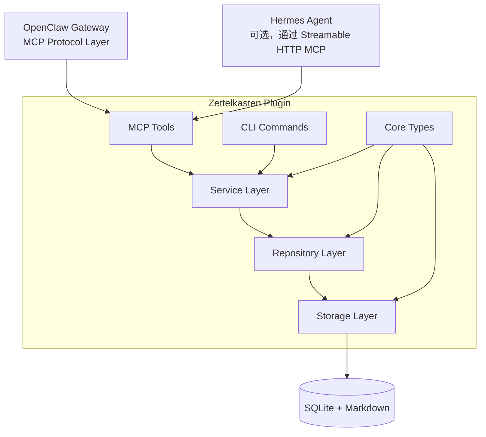

<p align="center">
  
</p>

# 🧠 Zettelkasten Second Memory

> **[OpenClaw](https://github.com/openclaw)（2026.4/2026.6+）与 [Hermes Agent](https://github.com/nousresearch/hermes-agent) 插件** —— 将 AI 对话转化为永久 Zettelkasten 知识库：原子化笔记、双向链接、知识蒸馏、通过 MCP 工具智能检索。

[English](README.md) · [简体中文](README.zh.md)

[](https://github.com/cx2002302-lang/zettelkasten-second-memory/releases)
[](https://github.com/openclaw)
[](https://github.com/nousresearch/hermes-agent)
[](src/mcp/server.ts)
[](LICENSE)
[](package.json)

---

## 📌 当前版本

| 组件 | 版本 | 状态 |
|------|------|------|
| 插件 | `v1.0.0-beta.8.1` | 活跃开发中 |
| Skill | `v1.0.0-beta.3` | 活跃开发中 |
| OpenClaw | `2026.4.24/2026.6.x` | 开发测试通过；兼容 >= 2026.4.23 |
| Hermes Agent | `v0.17.0` | 实验性支持，通过 MCP HTTP bridge |
| Node.js | `>= 22.14.0` | 必需（`node:sqlite`） |

**最新发布**: [v1.0.0-beta.8.1](https://github.com/cx2002302-lang/zettelkasten-second-memory/releases/tag/v1.0.0-beta.8.1) — OpenClaw 2026.6.x 与 Hermes MCP bridge 兼容性适配

---

## ✨ 核心特性

| 特性 | 说明 |
|------|------|
| 📝 **原子卡片** | 每条笔记都是独立、原子的知识单元，支持 `atomic` / `structure` / `source` 三种类型 |
| 🔗 **双向链接** | 11 种语义化链接类型（支持、细化、扩展、反驳、示例…），构建真正的知识图谱 |
| 🔍 **全文搜索** | SQLite FTS5 + LIKE 双引擎，支持中文分词与模糊匹配 |
| 🤖 **AI 集成** | 通过 MCP 协议与 OpenClaw 及 Hermes Agent 深度集成，AI 自动记录对话知识 |
| 🔄 **知识蒸馏** | CEQRC 流水线自动将碎片笔记提炼为永久知识 |
| 🏷️ **标签系统** | 灵活的标签分类与统计，支持标签云分析 |
| 📦 **Markdown 原生** | 所有笔记以 Markdown 存储，数据完全属于你 |
| 🧟 **僵尸笔记检测** | 自动识别陈旧笔记（180+天未更新、零引用），`zk_find_zombies` |
| ✨ **知识发光度** | 综合图中心性、引用数、时间衰减的知识重要性评分 |
| 📦 **归档系统** | 将冷笔记移入 `archive` 文件夹；每日凌晨 2:00 自动归档 |
| 📜 **审计日志** | 完整的归档/恢复/自动归档操作历史，`zk_get_archive_log` |
| 🔎 **路径发现** | 任意两条笔记间的带权最短路径，支持中文路径解释 |
| 🌉 **Hermes 桥接** | 可选 Streamable HTTP MCP bridge，向 Hermes Agent（v0.17.0+）暴露全部工具 |

---

## ⚡ 性能基准

**测试环境**: Node.js v22.22.2, SQLite `:memory:`  
**测试规模**: 1,000 笔记创建与搜索 | **全部测试通过** ✅  
**当前测试套件**: 1,724 个单元 / 集成测试（Vitest）

---

## 📐 系统架构



---

## 🚀 快速开始

### 环境要求

- **Node.js** >= 22.14.0（需要内置 `node:sqlite`）
- **OpenClaw** `2026.4.24/2026.6.x`（兼容 >= 2026.4.23）
- **Hermes Agent** `v0.17.0+`（可选，用于 Hermes 集成）

### 安装

```bash
# 克隆仓库
git clone https://github.com/cx2002302-lang/zettelkasten-second-memory.git
cd zettelkasten-second-memory

# 安装依赖
npm install

# 运行测试
npm test
```

### 作为 OpenClaw 插件使用

```bash
# 1. 部署插件
bash scripts/deploy.sh

# 2. 配置 OpenClaw（编辑 ~/.openclaw/openclaw.json）
# 确保 plugins.load.paths 包含插件路径

# 3. 重启 Gateway
openclaw gateway restart

# 4. 初始化数据库
openclaw zk init

# 5. 健康检查
openclaw zk doctor
```

### 与 Hermes Agent 集成（可选）

```bash
# 1. 构建 MCP bridge
npm run build:bridge

# 2. 启动 bridge（根据你的 OpenClaw 环境调整 DB/notes 路径）
ZETTELKASTEN_DB_PATH=~/.openclaw/zettelkasten/zettelkasten.db \
ZETTELKASTEN_NOTES_DIR=~/.openclaw/zettelkasten/notes \
ZETTELKASTEN_MCP_PORT=9090 \
node dist/mcp/http-bridge.js

# 3. 在 Hermes 配置中添加 MCP 服务器：
# mcp_servers:
#   zettelkasten:
#     type: http
#     url: "http://<openclaw-host>:9090/mcp"
#     enabled: true

# 4. 验证连通性
hermes mcp test zettelkasten
```

版本兼容性细节请参见 [`docs/COMPATIBILITY.md`](docs/COMPATIBILITY.md)。

## 🛠️ CLI 命令

| 命令 | 说明 |
|------|------|
| `openclaw zk init` | 初始化数据库和目录结构 |
| `openclaw zk doctor` | 运行健康检查 |
| `openclaw zk status` | 查看系统状态 |
| `openclaw zk new` | 创建新笔记 |
| `openclaw zk list` | 列出笔记 |
| `openclaw zk search <query>` | 搜索笔记 |
| `openclaw zk show <id>` | 查看笔记详情 |
| `openclaw zk link <from> <to>` | 创建笔记链接 |
| `openclaw zk review-stats` | 查看审核统计 |
| `openclaw zk review-pending` | 列出待审核笔记 |
| `openclaw zk feedback-stats` | 查看反馈统计 |
| `openclaw zk prompt-stats` | 查看提示词进化统计 |
| `openclaw zk curation-stats` | 查看样本策展统计 |

---

## 🧩 MCP 工具（供 AI 调用）

| 工具 | 权限 | 说明 |
|------|------|------|
| `zk_search_notes` | 读 | 全文搜索笔记 |
| `zk_get_note` | 读 | 获取单条笔记 |
| `zk_get_backlinks` | 读 | 获取反向链接 |
| `zk_find_path` | 读 | 查找笔记间的路径 |
| `zk_create_note` | 写 | 创建新笔记 |
| `zk_update_note` | 写 | 更新笔记 |
| `zk_create_link` | 写 | 创建笔记链接 |
| `zk_run_ceqrc` | 写 | 运行认知流水线 |
| `zk_distill_memory` | 写 | 蒸馏会话记忆 |
| `zk_review_note` | 写 | 审核笔记 |
| `zk_get_review_panel` | 读 | 获取待审核面板 |
| `zk_submit_review` | 写 | 提交审核 |
| `zk_get_review_stats` | 读 | 获取审核统计 |
| `zk_submit_feedback` | 写 | 提交用户反馈 |
| `zk_get_feedback_stats` | 读 | 获取反馈统计 |
| `zk_analyze_feedback_trends` | 读 | 分析反馈趋势 |
| `zk_get_active_prompt` | 读 | 获取活跃提示词版本 |
| `zk_get_prompt_stats` | 读 | 获取提示词进化统计 |
| `zk_get_curation_stats` | 读 | 获取策展统计 |
| `zk_export_samples` | 写 | 导出策展样本 |

---

## 📁 项目结构

```
zettelkasten-second-memory/
├── src/                    # 插件源码
│   ├── core/               # 类型定义、常量、工具函数
│   ├── storage/            # 数据库 Schema、FTS5、模板管理
│   ├── repository/         # 数据访问层（笔记、链接、标签、审核…）
│   ├── service/            # 业务逻辑（CEQRC、蒸馏、去重…）
│   ├── integration/        # OpenClaw 集成（Agent 配置、定时任务、会话钩子）
│   ├── mcp/                # MCP 工具定义与服务器
│   ├── plugin/             # OpenClaw 插件入口与清单
│   ├── examples/           # 使用示例
│   └── index.ts            # 库入口
├── skills/brain/           # AI Skill（提示词、规则、工作流）
├── scripts/                # 部署脚本
├── docs/                   # 使用文档
├── package.json
├── LICENSE
└── README.md
```

---

## 🧠 第二记忆 Skill（AI 集成）

本项目包含一个 **Brain Skill**，让 AI 代理自动将对话中的知识保存到 Zettelkasten：

```bash
# 安装 Skill
cp -r skills/brain ~/.openclaw/skills/zettelkasten-brain

# 激活 Skill
openclaw config set agents.defaults.skills '["zettelkasten-brain"]'

# 重启 Gateway
openclaw gateway restart
```

激活后，AI 会在对话中自动：
- 🔍 回答前先搜索知识库
- 📝 识别并保存重要信息
- 🔗 智能建立笔记关联
- 📦 会话结束时归档讨论

---

## 📊 数据库 Schema

系统使用 SQLite，核心表包括：

| 表名 | 说明 |
|------|------|
| `zettel_notes` | 笔记主表（标题、内容、状态、置信度…） |
| `zettel_links` | 双向链接表（11 种语义链接类型） |
| `zettel_tags` | 标签表 |
| `zettel_note_tags` | 笔记-标签关联表 |
| `zettel_reviews` | 审核记录表 |
| `zettel_feedback` | 反馈数据表 |
| `zettel_prompt_versions` | 提示词版本表 |
| `zettel_meta` | 元数据表 |

FTS5 虚拟表提供全文搜索能力。

---

## 🧪 测试

```bash
# 运行所有测试
npm test
```

当前测试覆盖：
- Repository 层（CRUD、搜索、链接、标签）
- Service 层（CEQRC、蒸馏、去重、解析）
- Integration 层（配置、调度）
- MCP Server（工具注册与调用）

---

## 📜 许可证

[MIT](LICENSE) © Zettelkasten Contributors

---

## 🙏 致谢

- 灵感来源于 [Niklas Luhmann](https://en.wikipedia.org/wiki/Niklas_Luhmann) 的 Zettelkasten 方法
- 基于 [OpenClaw](https://github.com/openclaw) 插件架构构建
- 使用 SQLite FTS5 实现全文搜索
