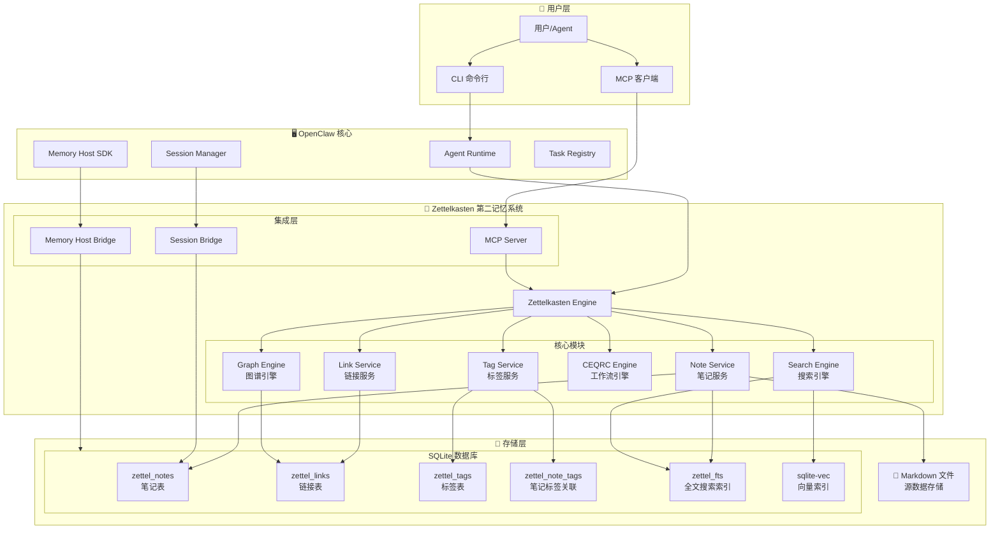

# 系统架构图

```mermaid
flowchart TB
    subgraph User_Layer["👤 用户层"]
        User["用户/Agent"]
        CLI["CLI 命令行"]
        MCP["MCP 客户端"]
    end

    subgraph OpenClaw_Core["🖥️ OpenClaw 核心"]
        Agent_Runtime["Agent Runtime"]
        Memory_Host["Memory Host SDK"]
        Session_Mgr["Session Manager"]
        Task_Registry["Task Registry"]
    end

    subgraph Zettelkasten_System["🧠 Zettelkasten 第二记忆系统"]
        Zettel_Engine["Zettelkasten Engine"]
        
        subgraph Core_Modules["核心模块"]
            Note_Service["Note Service<br/>笔记服务"]
            Link_Service["Link Service<br/>链接服务"]
            Tag_Service["Tag Service<br/>标签服务"]
            CEQRC_Engine["CEQRC Engine<br/>工作流引擎"]
            Search_Engine["Search Engine<br/>搜索引擎"]
            Graph_Engine["Graph Engine<br/>图谱引擎"]
        end
        
        subgraph Integration_Layer["集成层"]
            Memory_Bridge["Memory Host Bridge"]
            Session_Bridge["Session Bridge"]
            MCP_Server["MCP Server"]
        end
    end

    subgraph Storage_Layer["💾 存储层"]
        subgraph SQLite_DB["SQLite 数据库"]
            Notes_Table["zettel_notes<br/>笔记表"]
            Links_Table["zettel_links<br/>链接表"]
            Tags_Table["zettel_tags<br/>标签表"]
            Note_Tags_Table["zettel_note_tags<br/>笔记标签关联"]
            FTS_Table["zettel_fts<br/>全文搜索索引"]
            Vector_Table["sqlite-vec<br/>向量索引"]
        end
        Markdown_Files["📄 Markdown 文件<br/>源数据存储"]
    end

    User --> CLI
    User --> MCP
    CLI --> Agent_Runtime
    MCP --> MCP_Server
    
    Agent_Runtime --> Zettel_Engine
    Memory_Host --> Memory_Bridge
    Session_Mgr --> Session_Bridge
    
    Zettel_Engine --> Note_Service
    Zettel_Engine --> Link_Service
    Zettel_Engine --> Tag_Service
    Zettel_Engine --> CEQRC_Engine
    Zettel_Engine --> Search_Engine
    Zettel_Engine --> Graph_Engine
    
    Note_Service --> Notes_Table
    Note_Service --> FTS_Table
    Note_Service --> Markdown_Files
    
    Link_Service --> Links_Table
    Tag_Service --> Tags_Table
    Tag_Service --> Note_Tags_Table
    
    Search_Engine --> FTS_Table
    Search_Engine --> Vector_Table
    Graph_Engine --> Links_Table
    
    Memory_Bridge --> SQLite_DB
    Session_Bridge --> Notes_Table
    MCP_Server --> Zettel_Engine
```
