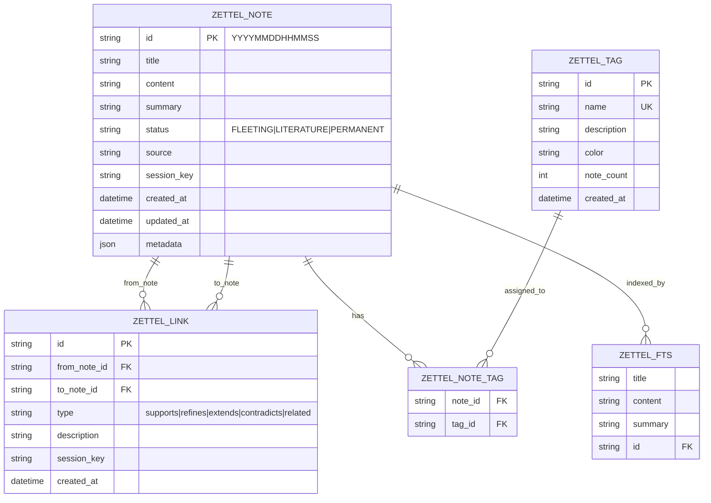

# 数据模型关系图

```mermaid
erDiagram
    ZETTEL_NOTE ||--o{ ZETTEL_LINK : "from_note"
    ZETTEL_NOTE ||--o{ ZETTEL_LINK : "to_note"
    ZETTEL_NOTE ||--o{ ZETTEL_NOTE_TAG : "has"
    ZETTEL_TAG ||--o{ ZETTEL_NOTE_TAG : "assigned_to"
    ZETTEL_NOTE ||--o{ ZETTEL_FTS : "indexed_by"

    ZETTEL_NOTE {
        string id PK "YYYYMMDDHHMMSS"
        string title
        string content
        string summary
        string status "FLEETING|LITERATURE|PERMANENT"
        string source
        string session_key
        datetime created_at
        datetime updated_at
        json metadata
    }

    ZETTEL_LINK {
        string id PK
        string from_note_id FK
        string to_note_id FK
        string type "supports|refines|extends|contradicts|related"
        string description
        string session_key
        datetime created_at
    }

    ZETTEL_TAG {
        string id PK
        string name UK
        string description
        string color
        int note_count
        datetime created_at
    }

    ZETTEL_NOTE_TAG {
        string note_id FK
        string tag_id FK
    }

    ZETTEL_FTS {
        string title
        string content
        string summary
        string id FK
    }
```
