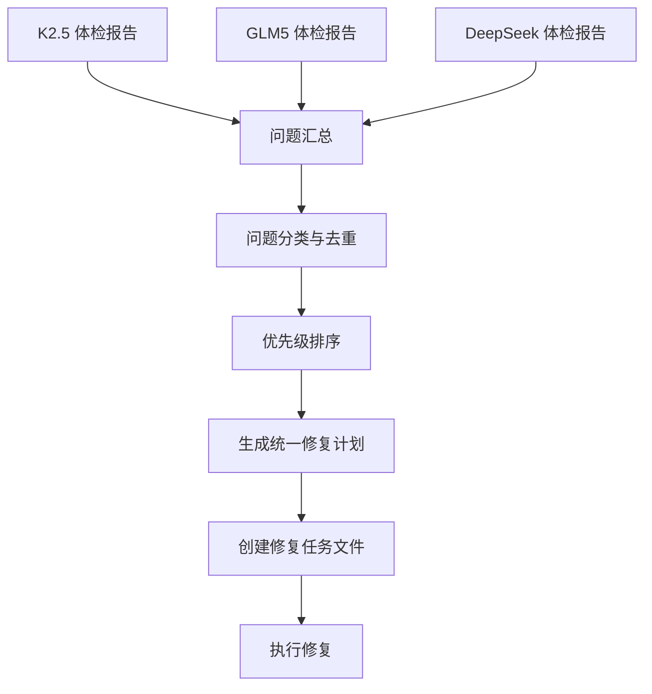
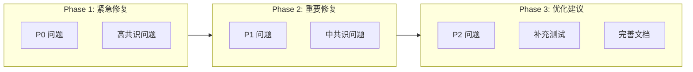

# Zettelkasten 360° 体检报告整合计划

## 📋 概述

本计划描述如何整合来自三个 AI 模型（K2.5、GLM5、DeepSeek）的 360° 体检报告，形成统一的修复路线图。

---

## 📁 体检报告文件

| 模型 | 文件路径 | 状态 |
|------|----------|------|
| K2.5 (Claude) | [`plans/zettelkasten-360-health-report.md`](plans/zettelkasten-360-health-report.md) | ✅ 已完成 |
| GLM5 | [`plans/zettelkasten-360-health-report-glm5.md`](plans/zettelkasten-360-health-report-glm5.md) | ✅ 已完成 |
| DeepSeek | [`plans/zettelkasten-360-health-report-deepseek.md`](plans/zettelkasten-360-health-report-deepseek.md) | ✅ 已完成 |

---

## 🔄 整合流程



---

## 🎯 整合步骤

### 步骤 1: 收集三份报告

等待 GLM5 和 DeepSeek 完成各自的体检报告填写。

### 步骤 2: 问题提取与标准化

从三份报告中提取所有问题，统一格式：

```typescript
interface HealthIssue {
  id: string;                    // 唯一标识
  description: string;           // 问题描述
  location: string;              // 文件位置
  severity: "P0" | "P1" | "P2";  // 严重程度
  category: "architecture" | "code-quality" | "type-safety" | "test-coverage" | "documentation" | "security";
  reportedBy: ("K2.5" | "GLM5" | "DeepSeek")[];  // 报告来源
  consensus: number;             // 共识度 (1-3)
  fixSuggestion: string;         // 修复建议
  estimatedEffort: "S" | "M" | "L";  // 预估工作量
}
```

### 步骤 3: 问题去重与共识计算

| 共识级别 | 说明 | 处理方式 |
|----------|------|----------|
| 🔴 高共识 (3/3) | 所有模型都发现问题 | 最高优先级，必须修复 |
| 🟡 中共识 (2/3) | 两个模型发现问题 | 高优先级，建议修复 |
| 🟢 低共识 (1/3) | 单个模型发现问题 | 需人工判断 |

### 步骤 4: 优先级矩阵

| 严重程度 \ 共识度 | 高共识 (3/3) | 中共识 (2/3) | 低共识 (1/3) |
|-------------------|--------------|--------------|--------------|
| **P0 严重** | 🔥 立即修复 | 🔥 立即修复 | ⚠️ 人工评估 |
| **P1 重要** | ⚡ 本周修复 | ⚡ 本周修复 | 📋 计划修复 |
| **P2 建议** | 📋 计划修复 | 📋 可选修复 | 💭 待定 |

### 步骤 5: 生成统一修复计划

输出文件：
- [`plans/zettelkasten-health-repair-plan.md`](plans/zettelkasten-health-repair-plan.md) - 统一修复计划
- [`plans/zettelkasten-health-issues.json`](plans/zettelkasten-health-issues.json) - 结构化问题数据

---

## 📊 预期整合结果

### K2.5 已发现的关键问题

基于 K2.5 报告，以下是已识别的关键问题：

#### P0 严重问题

| # | 问题 | 位置 | 共识 |
|---|------|------|------|
| 1 | 测试覆盖率仅 45/100 | 全局 | 待确认 |
| 2 | `searchNotes` 空实现 | [`mcp/server.ts`](src/mcp/server.ts:60) | 待确认 |

#### P1 重要问题

| # | 问题 | 位置 | 共识 |
|---|------|------|------|
| 1 | `any` 类型使用 | [`review-service.ts`](src/service/review-service.ts:163), [`note-repository.ts`](src/repository/note-repository.ts:242) | 待确认 |
| 2 | TODO 注释未处理 | 多处 | 待确认 |

---

## 🛠️ 修复执行流程



---

## 📋 执行检查清单

- [x] GLM5 完成体检报告
- [x] DeepSeek 完成体检报告
- [x] 提取并标准化所有问题
- [x] 计算问题共识度
- [x] 生成优先级矩阵
- [x] 创建统一修复计划文档
- [ ] 创建结构化问题数据文件
- [ ] 开始 Phase 1 紧急修复
- [ ] 开始 Phase 2 重要修复
- [ ] 开始 Phase 3 优化建议
- [ ] 最终健康度复测

---

## 🎯 成功标准

| 指标 | 当前值 | 目标值 | 验收标准 |
|------|--------|--------|----------|
| 综合健康度 | 73.4/100 | >85/100 | 三模型共识 |
| 测试覆盖率 | 45/100 | >80/100 | 覆盖率报告 |
| P0 问题数 | 2 | 0 | 问题清零 |
| P1 问题数 | 4 | <2 | 问题减少 |
| 类型安全得分 | 82/100 | >90/100 | 无 `any` 类型 |

---

## 📝 下一步行动

1. **切换模型**: 使用 GLM5 填写 [`plans/zettelkasten-360-health-report-glm5.md`](plans/zettelkasten-360-health-report-glm5.md)
2. **切换模型**: 使用 DeepSeek 填写 [`plans/zettelkasten-360-health-report-deepseek.md`](plans/zettelkasten-360-health-report-deepseek.md)
3. **整合分析**: 回到 K2.5 进行三份报告的整合分析
4. **生成计划**: 创建统一修复计划
5. **执行修复**: 切换到 Code 模式进行修复

---

*整合计划版本: v1.0*  
*创建时间: 2026-04-21*  
*最后更新: 2026-04-21*
