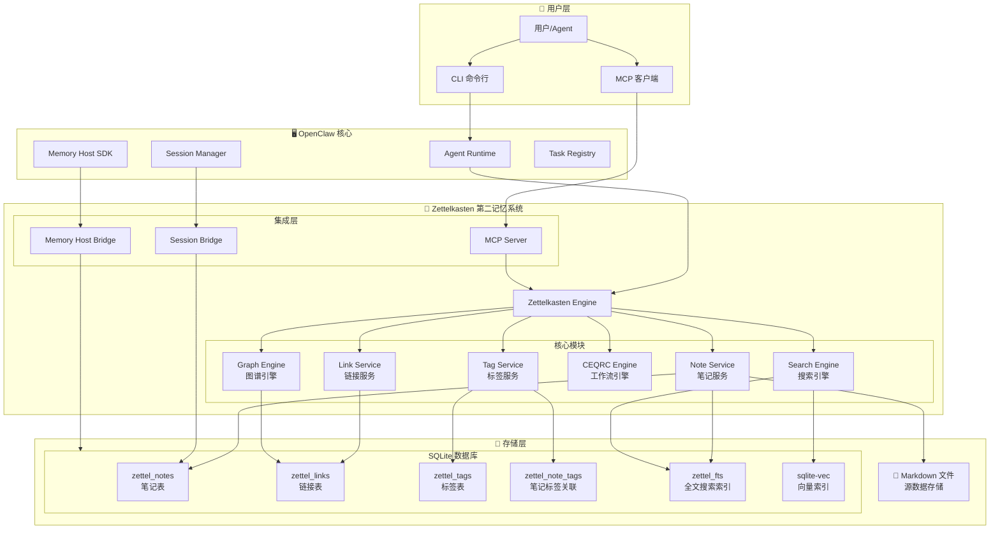
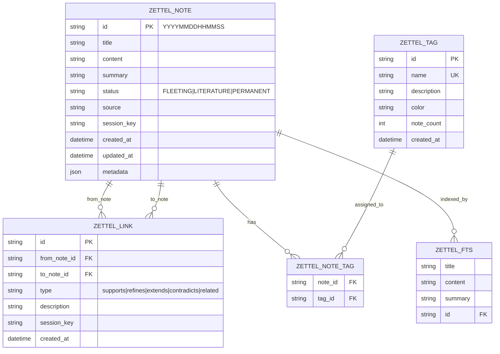
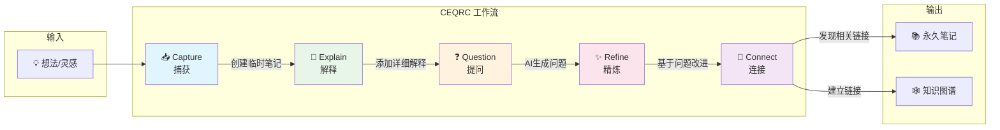
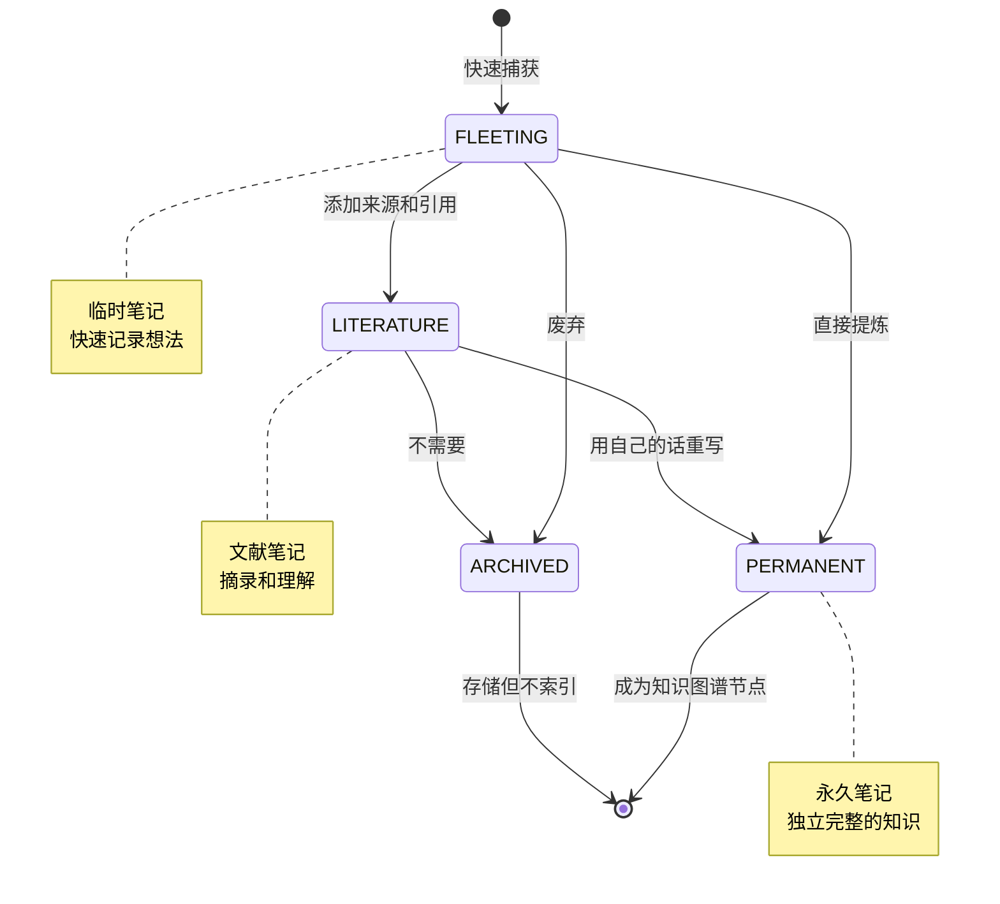

# Zettelkasten 第二记忆系统架构图

## 1. 整体系统架构



## 2. 数据模型关系图



## 3. CEQRC 工作流流程图



## 4. 笔记状态流转图



## 5. 链接类型语义图

```mermaid
flowchart TB
    subgraph Link_Types["链接类型语义"]
        direction TB
        
        subgraph Support["论证关系"]
            A1["笔记 A"] -->|supports| B1["笔记 B"]
            B1 -->|supported_by| A1
        end
        
        subgraph Refine["细化关系"]
            A2["笔记 A"] -->|refines| B2["笔记 B"]
            B2 -->|refined_by| A2
        end
        
        subgraph Extend["扩展关系"]
            A3["笔记 A"] -->|extends| B3["笔记 B"]
            B3 -->|extended_by| A3
        end
        
        subgraph Contradict["对立关系"]
            A4["笔记 A"] -->|contradicts| B4["笔记 B"]
            B4 -->|contradicted_by| A4
        end
        
        subgraph Example["实例关系"]
            A5["笔记 A"] -->|is_example_of| B5["笔记 B"]
            B5 -->|has_example| A5
        end
        
        subgraph Related["一般关联"]
            A6["笔记 A"] -->|related| B6["笔记 B"]
        end
    end
```



## 6. 搜索架构图

```mermaid
flowchart LR
    subgraph Search_Input["搜索输入"]
        Query["用户查询"]
    end

    subgraph Search_Modes["搜索模式"]
        Full_Text["全文搜索<br/>FTS5"]
        Semantic["语义搜索<br/>Embedding"]
        Hybrid["混合搜索<br/>Combined"]
        Graph["图谱搜索<br/>Graph Traversal"]
    end

    subgraph Search_Process["搜索处理"]
        Query_Expansion["查询扩展<br