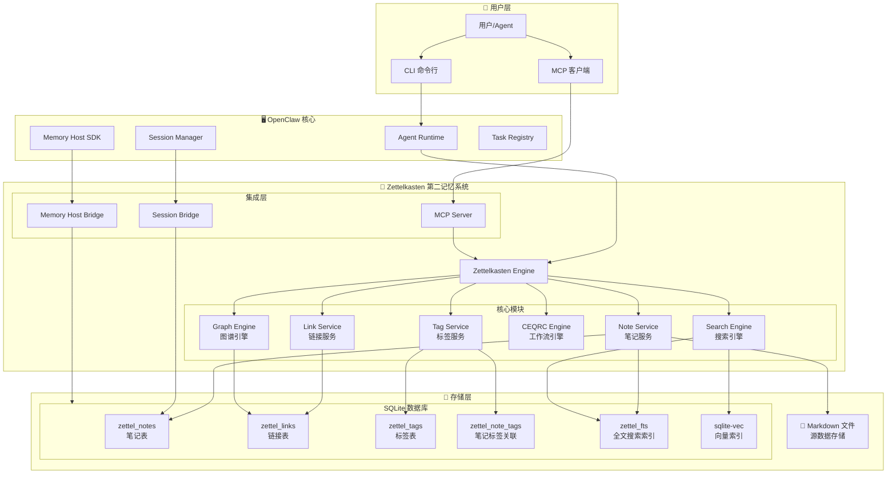
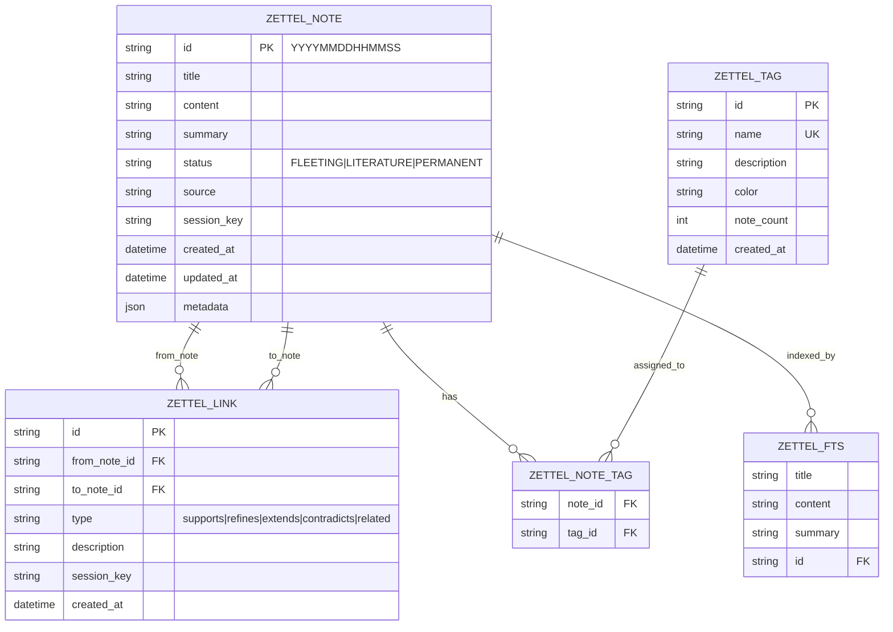
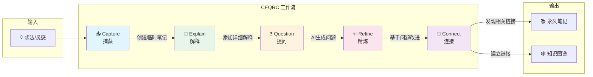
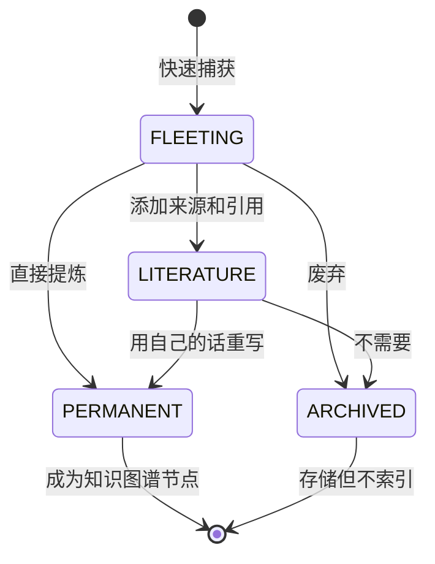
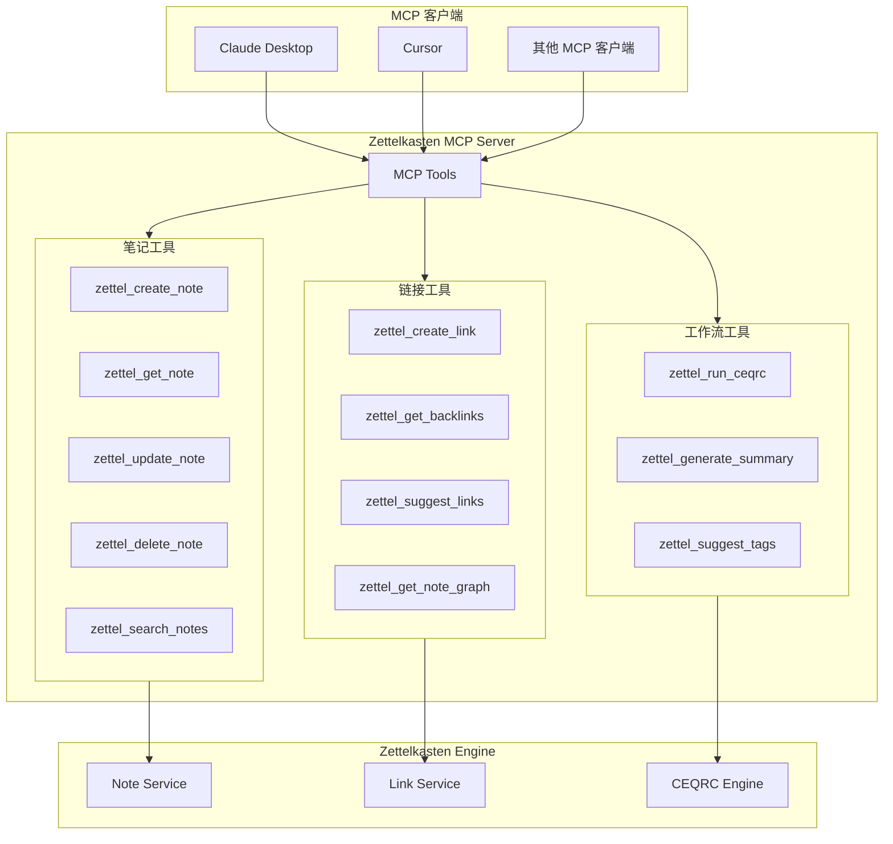
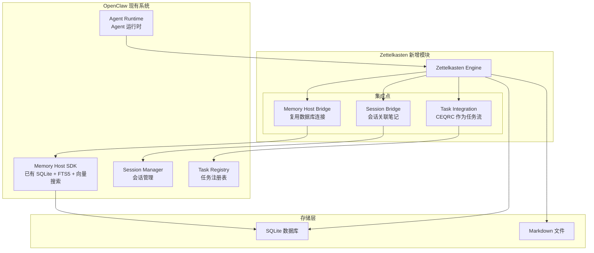
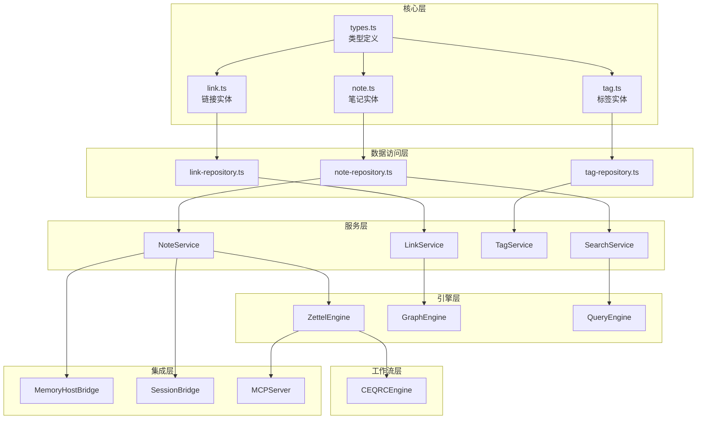

# Zettelkasten 第二记忆系统 - 架构信息图

## 1. 整体系统架构

## 2. 数据模型关系图

## 3. CEQRC 工作流流程图

## 4. 笔记状态流转图

## 5. 链接类型语义图

```mermaid
flowchart TB
    subgraph Link_Types["链接类型语义"]
        direction TB
        
        subgraph Support["论证关系"]
            A1["笔记 A"] -->|supports| B1["笔记 B"]
            B1 -->|supported_by| A1
        end
        
        subgraph Refine["细化关系"]
            A2["笔记 A"] -->|refines| B2["笔记 B"]
            B2 -->|refined_by| A2
        end
        
        subgraph Extend["扩展关系"]
            A3["笔记 A"] -->|extends| B3["笔记 B"]
            B3 -->|extended_by| A3
        end
        
        subgraph Contradict["对立关系"]
            A4["笔记 A"] -->|contradicts| B4["笔记 B"]
            B4 -->|contradicted_by| A4
        end
        
        subgraph Example["实例关系"]
            A5["笔记 A"] -->|is_example_of| B5["笔记 B"]
            B5 -->|has_example| A5
        end
        
        subgraph Related["一般关联"]
            A6["笔记 A"] -->|related| B6["笔记 B"]
        end
    end
```

## 6. MCP 工具接口图

## 7. 与 OpenClaw 集成架构图

## 8. 模块依赖关系图

---

## 图例说明

| 符号 | 含义 |
|------|------|
| 🧠 | 核心系统 |
| 💾 | 存储组件 |
| 📄 | 文件存储 |
| 🔗 | 链接/关系 |
| 📥 | 输入/捕获 |
| 📚 | 输出/永久存储 |
| 💡 | 想法/灵感 |
| ❓ | 问题/疑问 |
| ✨ | 精炼/改进 |
| 🕸️ | 知识图谱 |
| 👤 | 用户 |
| 🖥️ | 系统组件 |